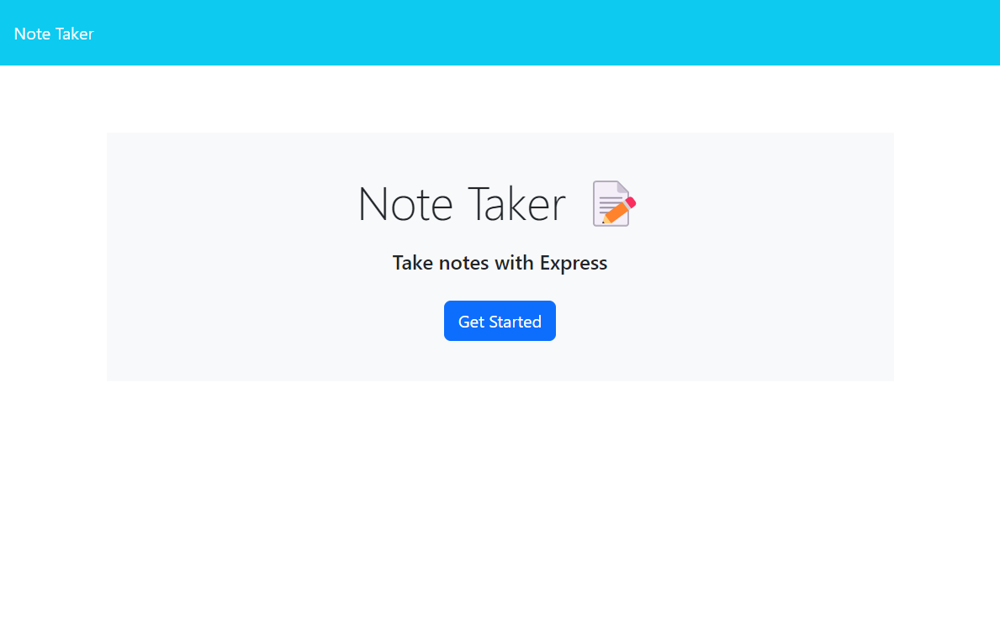
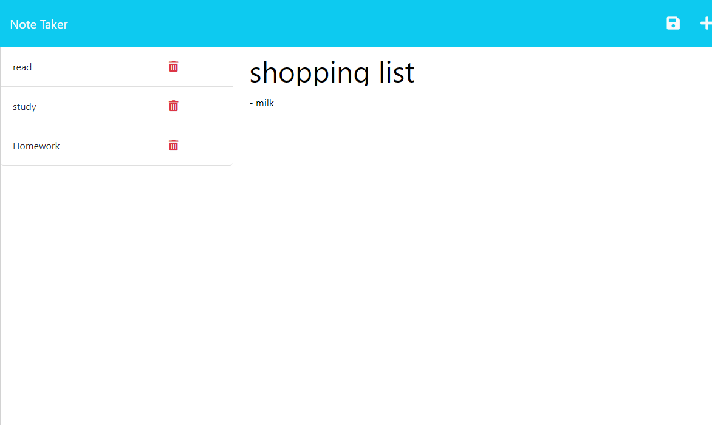

# Note Taker 

## Description

This application allows the user to write, save, and delete previous notes. This is an easy way to keep track of users toughts and their to-do tasks.

## Table of Contents

- [Installation](#installation)
- [Usage](#usage)
- [Credits](#credits)
- [License](#license)

## Installation

N/A

## Usage

The link to access the deploy application is: https://damp-reaches-66631.herokuapp.com/ 

- From the homepage, click "Get Started" button.
- Current list of notes are on the left side of the screen. Can read them by clicking on them.
- To delete a note, click on the delete icon on the right of the note.
- To add a new note, click on the "+" sign on the top right. Add a note title and text. A save icon will appear on the top right. The newly created note will now appear on the list of notes on the left of the screen.

The website looks like the following images (homepage and notes page):

## Credits

- Starter code provided by GA Tech Bootcamp.
- Mini-Project from Express Module used as reference.

NPM packages:
- Express
- nodemon
- generate-unique-id: https://www.npmjs.com/package/generate-unique-id

## License

Project under MIT license.